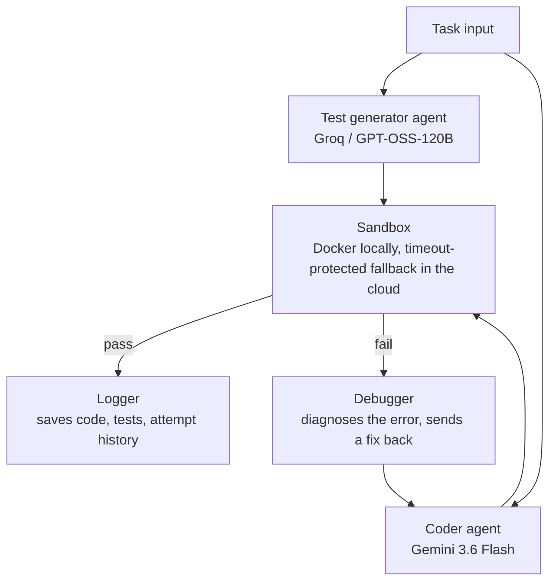

# Multi-Agent Coding Assistant

A coding agent system where two independent AI models collaborate to write and verify code: a **coder agent** writes a solution, an **independent test generator agent** writes the tests, and a **supervisor loop** runs them together — retrying with self-correction until the code passes, all inside a sandboxed execution environment.

**[Live demo](https://multi-agent-coding-assistant-9mreb4hcxzwjaximxgf8d4.streamlit.app/)** · **[Benchmark results](#benchmark-results)**

---

## Why two independent agents?

A single model writing both the code and its own tests can pass its own blind spots along with it. Using an independent model (a different provider, different weights) to write the tests means the tests weren't shaped by the same assumptions as the solution — closer to how a second engineer reviewing your code catches things you wouldn't catch reviewing yourself.

## Architecture




## How it works

1. A task description (e.g. *"write a function that checks if a string is a palindrome"*) is sent to **two agents in parallel**:
   - The **coder agent** (Gemini) writes a Python solution
   - The **test generator agent** (Groq, running an open-weight GPT-OSS model) independently writes a set of test assertions for the same task, including edge cases
2. The **supervisor** runs the generated code against the generated tests inside an isolated sandbox
3. If the tests fail, the error output is sent back to the coder agent, which attempts a fix — this repeats up to 5 times
4. Every attempt (code, tests, pass/fail, error output) is logged to a JSON file per task
5. Both agents are contractually required to name the function under test `solution`, so they agree on an interface regardless of how the task is phrased — this was a real bug found during testing (see [Known limitations](#known-limitations--failure-analysis))

## Safety: sandboxed execution

Since the coder agent's output is untrusted, generated code never runs directly on the host machine:

- **Locally:** executed inside a Docker container with `--network none` (no internet access), memory and CPU limits, and a hard timeout
- **In the cloud (Streamlit Community Cloud does not support Docker):** falls back to a timeout-protected subprocess. This is a conscious tradeoff, documented here rather than hidden — full container isolation is used wherever the environment supports it, and the app detects at runtime which mode it's in

This was verified, not just assumed:
- An infinite-loop payload was caught and killed by the timeout instead of hanging the process
- A network-access attempt from inside the sandbox failed as expected (`Temporary failure in name resolution`)

## Tech stack

- **Coder agent:** Google Gemini API (`gemini-3.6-flash`)
- **Test generator agent:** Groq API (`openai/gpt-oss-120b`)
- **Sandbox:** Docker (local) / subprocess with timeout (cloud fallback)
- **UI:** Streamlit
- **Logging:** local JSON files, one per task

## Benchmark results

12 tasks spanning easy (palindrome check, FizzBuzz) to hard (topological sort, LRU cache).

| Metric | Result |
|---|---|
| Tasks solved | _fill in from your `run_benchmark.py` summary output_ |
| Average attempts per task | _fill in_ |

Run it yourself:
```bash
python run_benchmark.py
```

Full per-task logs are saved to `logs/`.

## Known limitations & failure analysis

Being transparent about where this breaks was a deliberate design goal, not an afterthought:

- **Interface mismatches between independent agents.** Early on, the coder agent and test generator agent would sometimes guess different function names for the same vague task (e.g. `add_two_numbers` vs. `sum_two_numbers`), causing every attempt to fail on a `NameError` that had nothing to do with the code's actual correctness. Fixed by requiring both agents to always name the function under test `solution`.
- **Cloud sandbox is weaker than local.** The Streamlit Cloud deployment cannot run Docker, so generated code there runs with a timeout but without full network/resource isolation. This is disclosed above rather than glossed over.
- **No cost/latency tracking yet** on a per-task basis — see future enhancements.

## Future enhancements

- **Reviewer agent:** a code-quality check between the coder and the sandbox, catching obvious issues before spending a test cycle. Scoped out of v1 deliberately — an additional LLM call per task adds cost and latency, and the industry-standard advice on multi-agent design is to add agents only when the benefit clearly outweighs that cost. Worth revisiting with real usage data.
- **Cost & latency tracking** per task, alongside pass/fail, to make the tradeoffs of the retry loop measurable rather than assumed.
- **Provider-agnostic model config** (already partially proven out — the coder agent was temporarily run against a local Ollama model during development when a cloud API hit its free-tier quota).

## Running locally

```bash
git clone <your-repo-url>
cd coding-agent
python -m venv venv
venv\Scripts\activate        # or source venv/bin/activate on Mac/Linux
pip install -r requirements.txt
```

Create a `.env` file:
```
GEMINI_API_KEY=your_key_here
GROQ_API_KEY=your_key_here
```

Run the app:
```bash
streamlit run streamlit_app.py
```

Or run the benchmark directly:
```bash
python run_benchmark.py
```